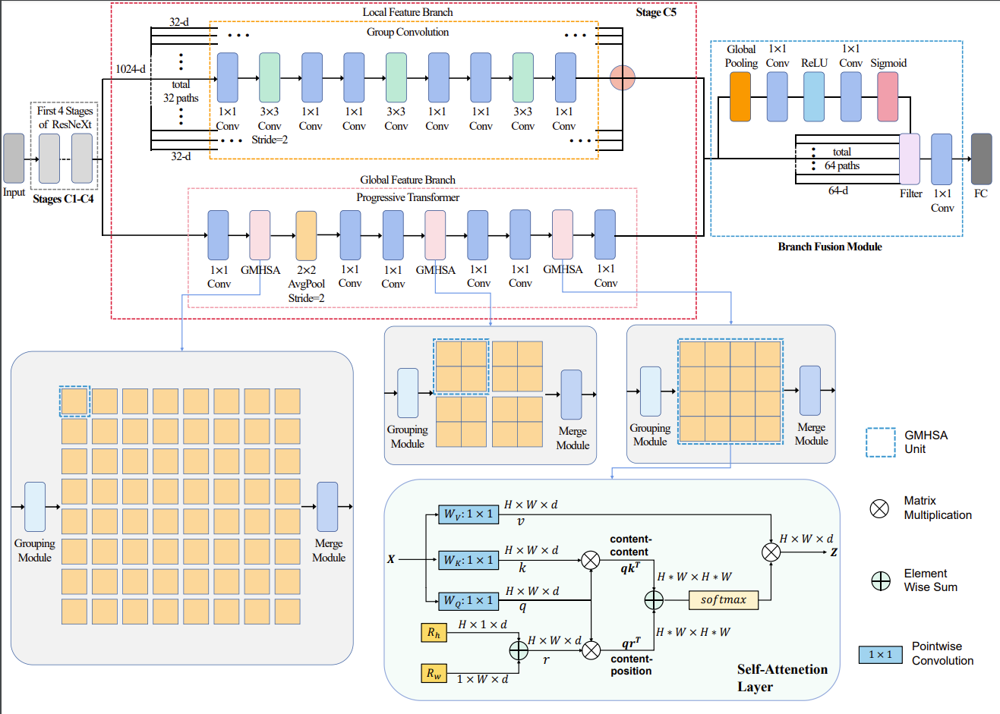

# 1. Describe
## 1.1 Network Architecture
The architecture of our multi-branch Transformer network.
The primary components are illustrated in dotted line blocks. The upper branch is the local feature branch, which is processed by group convolution, and the lower one is the global feature branch, which extracted the global features through progressive Transformer. At the end of the network structure, it is our feature fusion module.

# 2. How to reproduce
## 2.1 Environmental preparation
Install dependency package
```
pip install -r requirements.txt -i https://pypi.mirrors.ustc.edu.cn/simple
```

## 2.2 Run the code
Step-1 : The training model was verified by three fold cross test.
```terminal
python train.py --train_batch_size 32 --gpus 0 1 2 3
```


## More details and complete code will be released once our paper is accepted.
